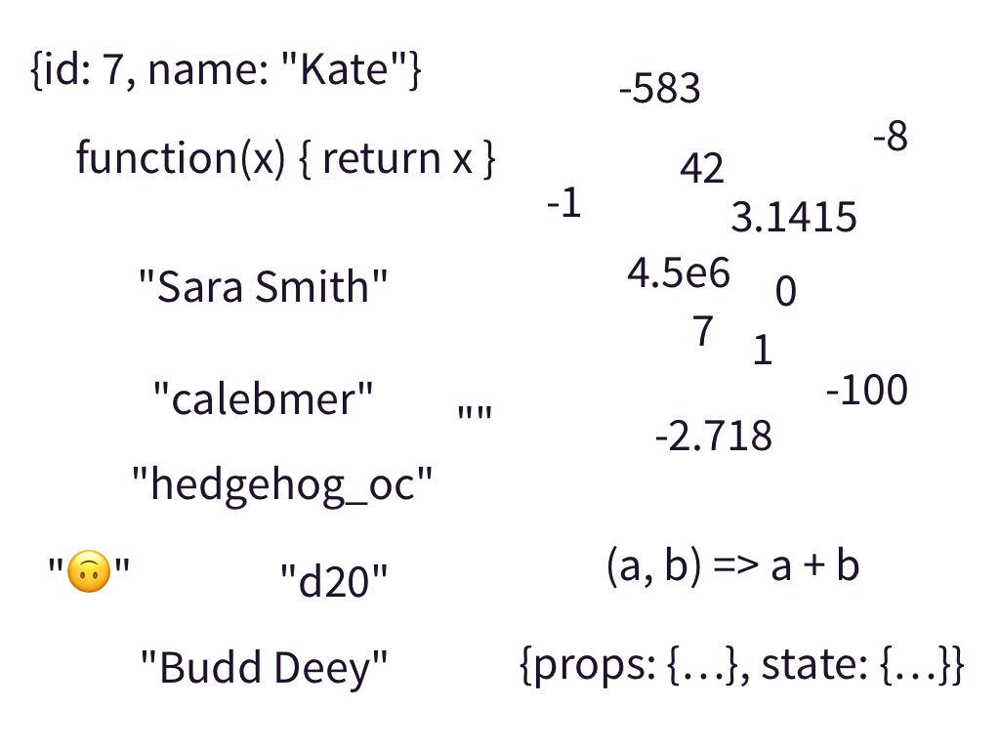
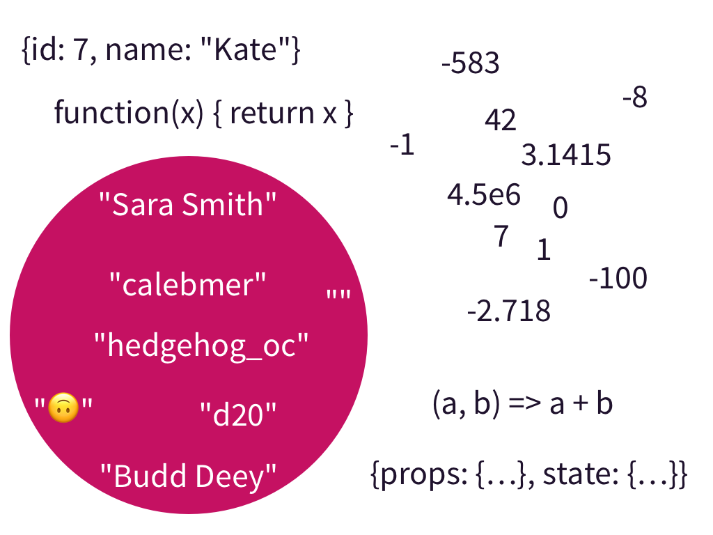
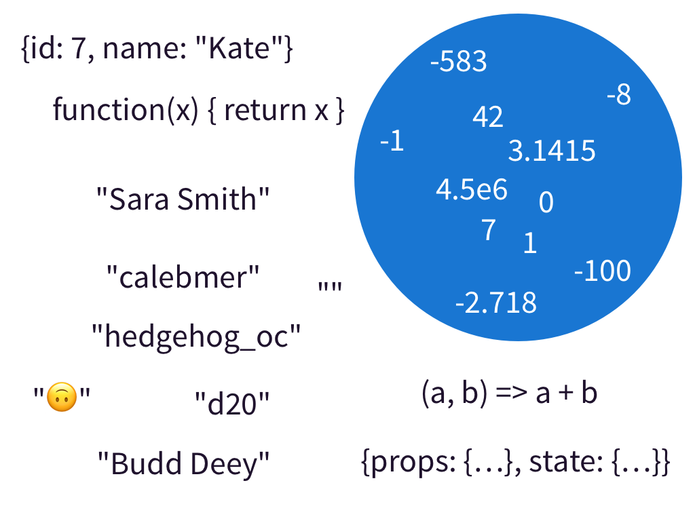
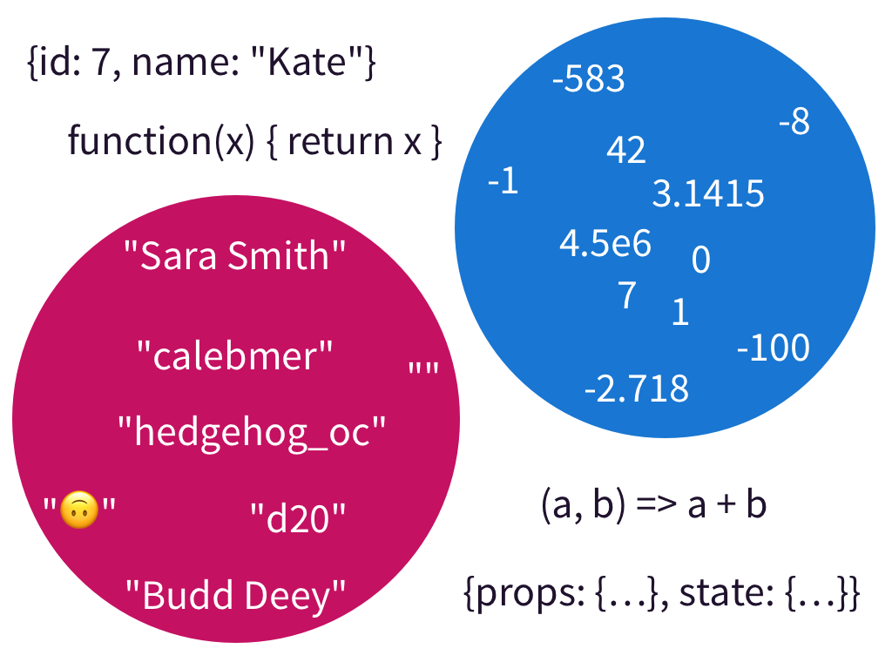
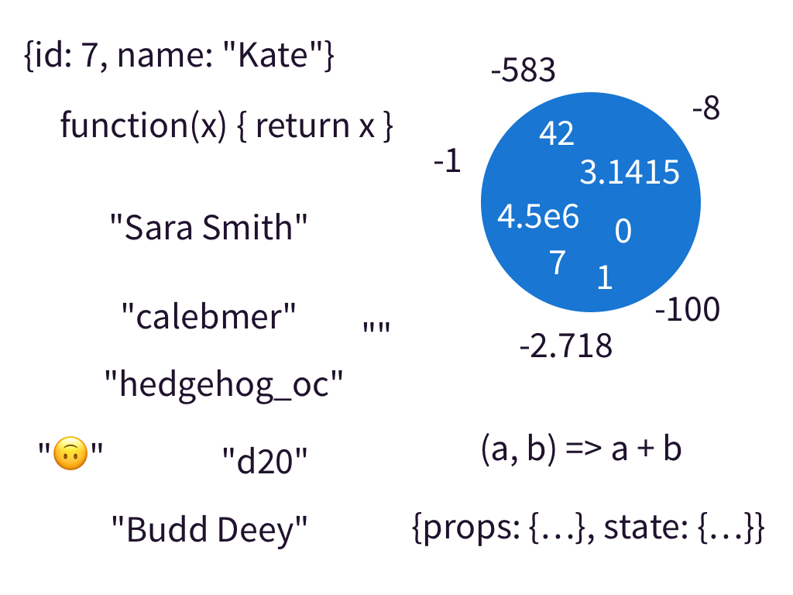
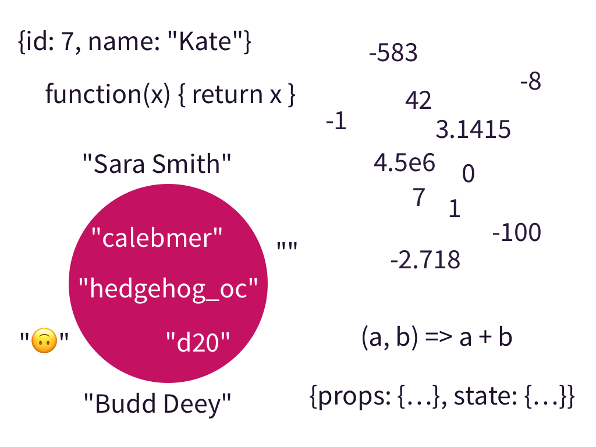

# How to Think About Type Systems

Pick the programming language you know best. I’ll pick JavaScript. Now imagine
every value you could create in that language. Yes, _every value_.

In JavaScript you’d have numbers like 0, 1, -42, and 3.14. You’d have strings
like the empty string `""` or the classic `"Hello, World!"`. You’d have objects
like `{id: 7, name: "Kate"}` or `{props: {...}, state: {...}}` if you’re a React
developer. You’d have functions like `function add(a, b) { return a + b }` or
`event => this.handleChange(event.target.value)`.

That’s a lot of values. An infinite amount of values.



This is the set of all values for your programming language.

In JavaScript, there’s nobody to stop you from calling a function with any value
from the entire _universe_ of values your programming language supports.

```js
async function fetchUser(id) {
  const response = await fetch(`https://example.org/api/user/${id}`);
  if (response.status !== 200) {
    throw new Error(`Unexpected status code: ${response.status}`);
  }
  return await response.json();
}

// Gotcha! This is an object.
fetchUser({
  sneakySneaky: true,
});
```

Let’s switch to TypeScript and annotate our `fetchUser()` function.

```ts
async function fetchUser(id: string) {
  // ...
}
```

A type represents a set of values. Here we say the type of `id` is a string.
That is, the `id` may be any value in the set of _all_ string values in your
programming language.



Likewise, if we annotated `id` as a number type then `id` may be any value in
the set of all number values in your programming language.



TypeScript gives us a feature not available in many other type systems. Union
types. With a union type, we may write `number | string` which represents the
`number` type _or_ the `string` type. A value with a type of `number | string`
may be any value in the set of all strings _or_ any value in the set of all
numbers.



We may ask a type system the question: “is this value a member of my type’s set
of values?” This allows us to compare individual values to types. Type systems
also have the difficult task of comparing two types to each other.

Let’s think about some smaller sets. Let’s say we write a TypeScript type which
can be any number zero through nine.

```ts
type Digit = 0 | 1 | 2 | 3 | 4 | 5 | 6 | 7 | 8 | 9;
```

Let’s say we write a second TypeScript type which can be either zero or one.

```ts
type BinaryDigit = 0 | 1;
```

We’ll then write a simple program with these types.

```ts
function isOdd(digit: Digit): boolean {
  return digit % 2 == 1;
}

function toBoolean(digit: BinaryDigit): boolean {
  return isOdd(digit);
}
```

The function `isOdd()` will tell us if our digit is an odd number. While the
implementation of `isOdd()` will work on any number we limit the type of its
parameter to `Digit`. The function `toBoolean()` will convert a `BinaryDigit`
into a boolean where `0` is `false` and `1` is `true`. It calls the `isOdd()`
function which expects a `Digit`. But, `BinaryDigit` is a different type than
`Digit`! This program works because the set of values represented by the
`BinaryDigit` type is a subset of the set of values represented by the `Digit`
type. Every value in `BinaryDigit` _also_ exists in `Digit`.

TODO: Image of the digit circle and the binary digit circle

We can say that `BinaryDigit` is a subset of `Digit`.

In classic type system lingo, we would instead say that `BinaryDigit` is a a
subtype of `Digit`.

Usually, subtyping comes up in the context of classes.

```ts
class Animal {
  // ...
}

class Dog extends Animal {
  // ...
}

function doSomethingWithAnimal(animal: Animal) {
  // ...
}

function doSomethingWithDog(dog: Dog) {
  return doSomethingWithAnimal(dog);
}
```

TODO: Image of subtyping circles with animals and dogs

Every instance of `Dog` is also an instance of `Animal`.

**The thing is, a type system isn’t the only way to restrict the set of values
for your variables.**

A condition will work just as well!

```js
if (x > 0) {
  // `x` is a positive number!
}
```



Type systems will automatically narrow the set of possible values for your
variables, but having a type system alone is _not enough_.

Let’s say you’re building an app where a user gets to pick a user name. Other
users will be able to reference them with an `@`. User names should only contain
letters and numbers (or if you’re hardcore, [UAX #31][uax-31]). You don’t want
spaces in user names!

[uax-31]: http://www.unicode.org/reports/tr31

If you type your user name as a string…

```ts
type UserName = string;
```


Your type is too broad. It contains the empty string (`""`) or an entire
sentence (`"The quick brown fox jumps over the lazy dog."`).

Some type systems will allow you to create custom data types. With a custom data
type, you can force the type to only be constructed in the module where the data
type is defined. That means you can have a custom `UserName` data type and no
one outside of your `UserName` module can create a new `UserName`. (tangent: how
I do this in TypeScript TODO: link)

You can put as many conditions on your `UserName` as you’d like. Such as a
regular expression.

```js
function createUserName(name) {
  if (/^[a-zA-Z0-9_-]+$/.test(name)) {
    return name;
  } else {
    throw new Error('Not a user name!');
  }
}
```



Now you may use your type system to automatically remember an even narrower set
of possible values then one already expressible in the types.

## Deep End

If you like this way of thinking about type systems and you’d like to dive into
the deep end then here’s some more thoughts for ya!

- In **C**, every value is logically a collection of bits. A 64-bit integer
  type, 64-bit float type, and a 64-bit pointer type all have the _same set of
  values_ at runtime. Yet the type system treats them as different types. Under
  the intuition of type systems proposed by this post we can explain this using
  custom data types. Custom data types allow us to give the same set of values
  different semantic meaning.
- JavaScript type systems also have the **intersection** type operator. `A & B`.
  Which represents the values shared by `A`’s set of values and `B`’s set of
  values. Like a Venn diagram. One missing primitive set operation in JavaScript
  type systems is the difference operator. For example, if we call the
  difference operator `/` then `number / 10` is every number _except_ for 10.
  Sure Flow has object difference and TypeScript has object difference and union
  difference, but there’s no true set difference operator.
- Type **Inference** capabilities of different type systems affect how types
  implicitly relate to each other. Common wisdom is that if you have
  sophisticated type inference you can’t have implicit subtyping. TypeScript has
  limited type inference capabilities but does support implicit subtyping. OCaml
  has sophisticated type inference capabilities but only supports explicit
  subtyping with the `<:` operator. Research like [MLsub][mlsub], however, shows
  a path to having implicit subtyping and sophisticated type inference. If you
  haven’t read the thesis, though, does not support invariant type parameters
  which may be inconvenient for programming styles which like mutability.
- [Dependent types][dependent-type] are a thing, but I don’t know enough about
  them to talk knowledgeably.

[mlsub]: https://www.cl.cam.ac.uk/~sd601/thesis.pdf
[dependent-type]: https://en.wikipedia.org/wiki/Dependent_type

## Further Reading

- I highly recommend reading the [Rust Virtual Structs
  proposal][rust-virtual-structs]. Lots of interesting insight into code reuse
  and type systems all to serve an efficient runtime representation.
- The [MLsub][mlsub] thesis describes an ML type system with implicit subtyping.
  It’s like the centaur (half person, half horse) equivalent of a type system.
- The [“Extensible records with scoped labels”][extensible-records] paper is an
  interesting read if you like object width-subtyping in TypeScript and Flow but
  you want ML inference.
- I gave a [talk](https://youtu.be/M6MsDBFwa6Y) once about similar ideas.

[rust-virtual-structs]:
  http://smallcultfollowing.com/babysteps/blog/2015/08/20/virtual-structs-part-3-bringing-enums-and-structs-together/
[extensible-records]:
  https://www.microsoft.com/en-us/research/wp-content/uploads/2016/02/scopedlabels.pdf
